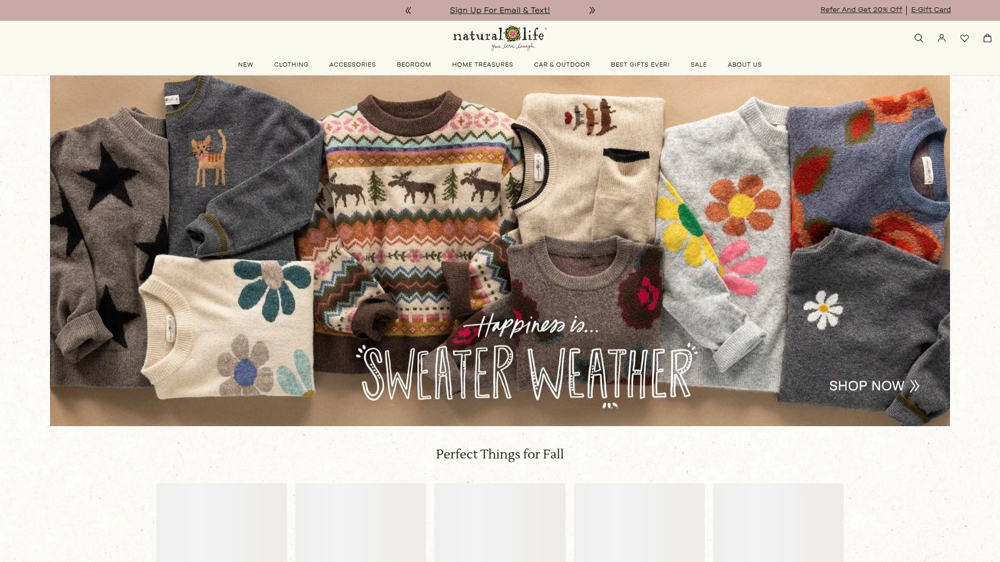

# 2025年十二家全球最佳成人连体睡衣品牌(舒适家居服)

在家办公或周末放松时最尴尬的事,就是穿着老旧睡衣收快递被邻居看到,或者视频会议前慌乱换衣服。专业的成人连体睡衣品牌提供一件式设计、天然面料制作、从客厅到街头都能穿的时尚外观,让你在舒适和体面之间找到完美平衡。无论是追求极简北欧风的设计师,还是喜欢卡通动物造型的二次元爱好者,这份榜单涵盖从立陶宛手工定制到挪威原创设计的12个全球品牌,帮你找到最适合体型、预算和穿着场景的连体家居服。

## **[Sofa Killer](https://sofakiller.com)**

立陶宛手工制作的欧洲连体家居服品牌,天然面料打造全家服装系列。

Sofa Killer总部位于立陶宛维尔纽斯,品牌创始故事源于创始人在本国找不到性价比高的优质连体服,决定自己制作后朋友纷纷要求购买,于是Sofa Killer的故事开始了。品牌核心理念是"从欧洲带着爱而来",为冲浪者和沙发冲浪者设计舒适面料的服装,强调自我表达和自由移动。

产品线覆盖成人连体服、儿童连体服、家庭亲子装、宠物服饰等全系列。成人款采用天然丝绒、纯亚麻、100%棉等材质,提供大码尺寸选择确保不同体型都能找到合适版型。深绿色北欧图案连体服、棕色丝绒男士连体服、复古风狗狗连体服等个性化设计体现品牌的独特审美。

**定制和质量**是Sofa Killer的竞争优势,不同于大规模生产的快时尚品牌,每件服装都由品牌团队手工缝制,如果库存没货需要等待制作但绝不会遗忘订单。Etsy店铺的评价显示"如此出色的连体衣!与卖家的联系超级友好且服务出色",客户赞赏高品质厚实纯亚麻面料和精心缝制的每一处细节。

价格区间从55美元的简约款到125美元的高级亚麻款,Etsy平台上大多数款式在85-95美元之间。支持全球配送,通过澳大利亚邮政等本地物流追踪,配送速度快于预期。30天退换政策让用户放心尝试。

社交媒体展示品牌生活方式营销,Instagram账号@sofakiller_com展示家庭穿着连体服在波兰度假的温馨场景,强调"家庭第一"和"连体服生活"理念。适合追求欧洲设计美学、重视天然面料和手工品质、希望全家统一风格的消费者。

## **[OnePiece](https://www.onepiece.com)**

挪威原创连体服品牌,创造高端休闲服的当代生活方式品牌。

OnePiece是挪威最成功的国际时尚品牌之一,产品销往近150个国家,美国、英国、德国、法国和北欧是最大市场。品牌以创造"原创连体服"而闻名,专注于高端休闲服市场。零售模式围绕电子商务构建,大部分销售来自官网onepiece.com。

**女士连体服系列**涵盖从条纹海军风到阿尔卑斯柔软天鹅绒等多种风格。经典款采用优质天鹅绒、针织或抓绒材质,设计强调舒适性和时尚感的平衡。价格从99美元的短袖连体服到249美元的天鹅绒高级款不等。

Trustpilot上3.5分评价(1000多条评论)显示品牌在客户服务和产品质量上表现稳定。正面评价称赞"超快速且友好的客户服务,在德国非常罕见"和"连体服质量优秀且充满风格,舒适、温暖、绝对美丽"。客服代表Johnny因快速研究问题、提供多种解决方案而受到表扬。

HuffPost生活版块2014年的报道称OnePiece连体服设计简洁但超时尚的外观让它们脱颖而出,从海军蓝白条纹到醒目设计应有尽有。Y2K复古风格的天鹅绒连体服在Poshmark二手平台以199美元转售,证明品牌保值性。

品牌故事和疯狂背后的历程在YouTube有专门纪录片讲述。适合追求斯堪的纳维亚简约设计、愿意为高品质支付溢价、重视品牌故事和国际认可度的消费者。

## **[OppoSuits](https://opposuits.com)**

荷兰趣味主题连体服品牌,官方授权角色造型覆盖全年龄段。

OppoSuits以大胆印花和主题派对装而闻名,成人连体服系列将趣味性和舒适性完美结合。品牌理念是"拥抱你内心的派对动物",从彩块连体服到中性实用带口袋抽绳帽设计,让成人连体服成为时尚宣言。

**主题系列**涵盖超级马里奥、索尼克、我的世界等官方授权游戏角色连体服,让电子游戏爱好者将虚拟世界带入现实。万圣节主题从可爱南瓜到诡异幽灵应有尽有,无需复杂服装直接拉链就绪去不给糖就捣蛋。

尺码指南详细标注OppoSuits采用修身设计,尺码之间犹豫时建议选择较大尺码。儿童系列同样丰富,从玩耍到派对或休息时间都完美适配,高质量材料确保多次洗涤后依然保持外观。

面料选择包括抓绒和睡衣连体服,完美适合寒冷秋冬夜晚,但OppoSuits连体服外观太出色可能你会穿着它走出卧室。价格亲民且款式多样,适合追求个性表达、参加主题派对、购买儿童礼物的家庭。

## **[Lazy One](https://lazyone.com)**

美国犹他州创立的趣味睡衣品牌,座右铭是"生活、自由和追求笑声"。

Lazy One创立于洛基山脉的犹他州,使命是让睡眠时光再次充满乐趣同时提升舒适度。品牌哲学"生活、自由和追求笑声"体现在将喜剧与舒适结合的所有产品中。

**产品线**从广受欢迎的中性幽默四角裤和睡衣衫起家,现在全家人都爱的FlapJack系列是季季热销款。成人连体睡衣系列强调所有标记为成人的连体服都是睡衣,无需在连体服里再穿睡衣。

独特设计包括可爱双关语和人人喜爱的有趣角色,提供明亮时尚的外观。连体服不仅适合睡觉,在沙发上依偎、壁炉旁放松或跑几趟差事都毫无违和感。品牌认为成人比小孩生活压力大得多,回家后换上最爱的连体服融化压力是最好的选择。

Walmart和The Pajama Company等主流零售商销售Lazy One产品线。Instagram账号@lazyoneinc展示匹配家庭睡衣和拖鞋,节日主题丰富覆盖圣诞节、独立日等。适合追求美式幽默、重视家庭匹配装、喜欢动物和俏皮设计的消费者。

## **[Kigurumi](https://www.kigurumi.com)**

日式动物造型连体睡衣专家,SAZAC正版授权的Cosplay级服装。

Kigurumi源自日本,指穿着毛绒动物角色服装的文化现象。Kigurumi.com和Kigurumi-Shop.com是北美主要零售商,销售SAZAC品牌正版动物连体睡衣。

**动物造型**涵盖从经典熊猫、独角兽、恐龙到小众浣熊、树懒等数十种选择。材质柔软舒适适合睡觉,同时足够精致可以参加动漫展、万圣节派对或主题活动。成人尺码确保高大体型也能舒适穿着,不会像儿童服装那样紧绷。

定价比普通睡衣略高但Cosplay质量明显优于廉价万圣节服装。Etsy上也有大量手工定制Kigurumi选择,独特或定制作品满足个性化需求。

Reddit用户推荐Kigurumi作为BIFL(买一辈子)级别的连体服品牌,强调其耐用性和舒适度。适合动漫爱好者、Cosplay参与者、希望在家扮演可爱角色放松的年轻群体。

## **[Footed Pajamas](https://footedpajamas.com)**

全家脚套连体睡衣专家,从婴儿到成人的完整尺码范围。

Footed Pajamas专注于脚套设计的连体睡衣,品牌标语"最佳全家脚套连体睡衣"准确概括其市场定位。Instagram账号@footedpajamascom鼓励用户标记#footedpajamascom分享穿着照片。

**脚套设计**是品牌核心特色,让双脚始终温暖舒适无需额外穿袜子。The Pajama Company评价称"你的孩子羡慕终结了",现在从婴儿到成人尺码应有尽有,每个家庭成员都能拥有舒适的一体式脚套睡衣。

材质选择包括抓绒适合寒冷季节,轻薄面料适合春秋过渡季节。Carter's等儿童品牌的脚套睡衣在Kohl's以8.99-18美元销售,展示该类型产品的大众市场接受度。

适合寒冷地区居民、脚部容易冰凉的人群、追求全家统一造型的家庭。Made in USA标签吸引支持本土制造的消费者。

## **[American Eagle Aerie](https://www.ae.com)**

美国青春休闲品牌的舒适loungewear线,连体裤和匹配套装主打。

Aerie是American Eagle旗下专注loungewear和内衣的子品牌,连体裤系列融合athleisure和家居服特点。GoodHousekeeping评选的2024年最佳loungewear品牌中,Aerie凭借超大码卫衣、舒适lounge服和可爱运动装入选。

**Crossover Flare Legging**提供多种内缝长度,软滑不紧绷的面料区别于压缩性运动紧身裤。Big Chill Crew Sweatshirt、Real Me High Waisted Crossover Flare Legging和Free Spirit Ribbed Tank Top是品牌最受欢迎loungewear单品。

尺码范围XXS到XXL覆盖广泛体型,价格从25美元背心到55美元卫衣都处于青少年和大学生可负担区间。品牌持续跟进athleisure趋势,经典款和多功能基础款并存。

Aerie loungewear连体裤页面展示从5%到70%不等的折扣,经常性促销活动让性价比进一步提升。适合18-30岁年轻女性、追求运动休闲风格、预算有限的大学生和职场新人。

## **[Athleta](https://athleta.gap.com)**

Gap旗下的女性运动品牌,loungewear连体裤强调活动性和时尚感。

Athleta是Gap Inc.旗下专注女性运动和休闲服的品牌,loungewear连体裤系列体现"为放松而设计不妥协时尚"的理念。产品线从合身到宽松轮廓应有尽有,确保每种体型都有讨人喜欢的外观。

**设计细节**包括可调节腰带、口袋和易穿脱拉链,同时提供功能性和便利性。柔软透气面料贴肤感觉良好,从在家lounging、跑差事到休闲外出都适用。价格从54.97美元促销款到139美元原价不等,经常有30-50%折扣。

多功能性体现在搭配运动鞋呈现轻松氛围,或搭配时尚配饰打造别致造型。适合任何季节,可以叠穿外套或单穿,是全年舒适的首选。

Reddit用户在loungewear推荐帖中多次提到Athleta与Lululemon、Vuori并列最爱品牌。尺码和具体款式影响范围,部分提供Petite小码选择。适合注重运动功能性、30-50岁中产阶级女性、愿意为质量支付中高价位的消费者。

## **[Spanx AirEssentials](https://www.spanx.com)**

塑身衣巨头的loungewear系列,轻如空气的spacer面料创新技术。

Spanx以塑身内衣闻名,AirEssentials系列将品牌技术应用于loungewear领域。超柔软且实质性的spacer面料外观像结构化氯丁橡胶但体感轻盈如云。

**GoodHousekeeping编辑和分析师**分享"在家办公和旅行时几乎住在这种面料里",证明其在实际使用中的舒适度。AirEssentials Half Zip(128美元)、AirEssentials Wide Leg Pant(138美元)和AirEssentials Jumpsuit(148美元)是系列核心单品。

虽然价格高于Aerie或OppoSuits,但Spanx的材料创新和版型设计吸引愿意投资高品质loungewear的专业女性。尺码范围XS到3X相比Athleta和Aerie更包容大码身材。

适合35岁以上专业女性、经常商务旅行需要可体面外穿的loungewear、追求创新面料科技的消费者。品牌在美国百货商店和官网均有销售渠道。

## **[Lunya](https://www.lunya.co)**

硅谷起家的睡衣科技公司,真丝和Pima棉loungewear的奢华选择。

Lunya将科技行业的创新思维应用于睡衣设计,真丝连体服代表品牌的奢华定位。Olivia Von Halle与Lunya在真丝onesie类别并驾齐驱,以卓越品质和精致设计著称。

**真丝面料优势**包括柔滑触感、温度调节能力和透气性,天然属性让睡眠更安宁。从低调优雅的单色到鲜明图案应有尽有,真丝onesie的多样性确保匹配每位女性品味。

工艺体现在每一处接缝、纽扣和下摆的精心放置,承诺不仅是时尚前卫的单品更是经久耐用的投资。拥抱真丝onesie意味着选择无与伦比的睡眠体验,奢华与放松交汇。

InstStyle将Lunya Organic Pima Cotton Wide Leg Lounge Jumpsuit列为最佳loungewear之一,售价198美元在Nordstrom有售。适合高收入女性、追求最高品质天然面料、重视可持续性的消费者。

## **[Natural Life](https://www.naturallife.com)**

波西米亚风格的彩色连体裤品牌,自由奔放的设计美学。

Natural Life专注于可爱、舒适和多彩的波西米亚连体裤,品牌标语"Shop Cute, Comfy & Colorful Boho Jumpsuits"准确传达其市场定位。2025年10月持续更新的系列展示品牌活跃度。

**波西米亚风格**体现在扎染图案、民族刺绣、流苏细节等设计元素,让loungewear兼具家居舒适和外出时尚。材质选择天然纤维如棉、亚麻和人造丝,透气性和环保性兼顾。

价格定位中等,比Lunya和Spanx亲民但高于快时尚品牌,平衡品质和可负担性。独立设计师品牌的身份吸引追求独特性不愿撞衫的消费者。

适合20-40岁热爱旅行、音乐节文化、瑜伽和冥想的自由精神女性。产品在品牌官网和精选Boutique店铺销售。

## **[Feejays](https://feejays.com)**

专利运动裤和卫衣的终极lounge服装,快速成为全球舒适客户首选。

Feejays以聪明制作保持舒适的专利技术为卖点,运动裤和卫衣迅速成为全球追求舒适客户的终极lounge服装。品牌专注于loungewear的功能性创新而非时尚外观。

**专利设计**细节未在搜索结果中详述,但品牌强调"cleverly made to keep you cozy"暗示在剪裁、面料或缝制技术上有独特之处。目标客户是将舒适度置于首位的居家人群。

相比Lunya的奢华真丝或Spanx的高科技面料,Feejays回归loungewear本质即极致舒适。品牌知名度不如前述大牌但在特定圈层享有口碑。

适合完全居家办公、极简主义者、不关心品牌标签只在乎实际舒适度的消费者。

## 常见问题

**成人连体睡衣适合什么身高和体型?**

大多数品牌提供从XS到XXL甚至3XL的广泛尺码,Sofa Killer强调大码尺寸可选,Spanx AirEssentials覆盖XS到3X是大码友好典范。OppoSuits提醒其设计偏修身,尺码之间犹豫建议选大一码。关键是查看品牌尺码表的胸围、腰围、臀围和长度数据,Footed Pajamas等包含脚套的款式需特别注意腿长。身高超过180cm的消费者选择OnePiece等欧洲品牌通常版型更友好,身材娇小者可考虑儿童XL或Aerie的XXS码。

**连体睡衣可以外穿出门吗?**

取决于款式和场合,Sofa Killer明确定位为"从客厅到街头"都能穿,OnePiece被HuffPost形容为"超时尚设计可以外穿"。Spanx AirEssentials因结构化外观被编辑们旅行时穿着,Athleta和Aerie的连体裤搭配运动鞋可以跑差事或休闲外出。卡通动物造型的Kigurumi和OppoSuits角色主题款更适合万圣节派对或动漫展而非日常外出。判断标准是面料质感(真丝、天鹅绒、结构化棉优于抓绒)、颜色(纯色或低调图案比夸张印花易搭配)和剪裁(合身或宽松得体比极度oversize专业)。

**如何清洗和保养连体睡衣?**

天然面料如Sofa Killer的纯亚麻和Lunya的真丝需要特殊护理,手洗或机洗轻柔模式冷水,平铺晾干避免缩水和变形。Lazy One和OppoSuits的棉质混纺和抓绒款可机洗烘干,但高温会降低抓绒柔软度建议低温。Spanx AirEssentials的spacer面料按标签说明通常可机洗。拉链款拉上拉链后再洗避免拉链钩住其他部位,带帽款不要用烘干机高温以防帽绳缩水。Kigurumi的毛绒面料第一次洗前检查标签,部分需要冷水手洗保持毛茸质感。投资高价位品牌如OnePiece和Lunya时,专业干洗延长使用寿命值得考虑。

## 结语

在众多成人连体睡衣品牌中,**[Sofa Killer](https://sofakiller.com)**凭借立陶宛手工缝制的欧洲工艺、100%天然面料(纯亚麻/棉/丝绒)承诺、从成人到儿童宠物的全家系列覆盖,以及85-125美元的合理定价,特别适合追求独特欧洲设计美学、重视可持续天然材质和希望全家统一风格的消费者。品牌不进行大规模生产而是接单后手工制作的模式,确保每件服装都经过精心缝制和质量把控,30天退换政策和Etsy店铺的高评分证明其客户满意度。无论你是需要在家办公时体面舒适的远程工作者,还是周末想穿着时尚loungewear出门买咖啡的生活方式追随者,选择与自己体型、预算和穿着场景匹配的连体睡衣品牌,才能在舒适和风格之间找到完美平衡。
